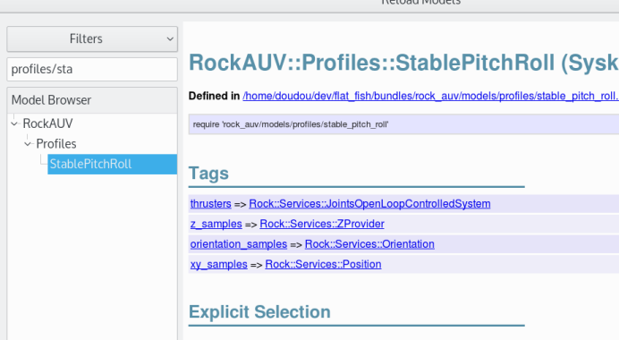
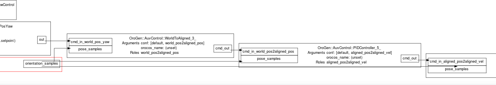

Dive! implements a modularized control strategy for AUVs. The general goal is
to provide a scheme where

- Commands can be produced in a few different frame of reference. This stemmed
  from our experience with doing complex tasks with AUVs: different tasks
  required different command domains (i.e. visual servoing on some axes but not
  others, position/velocity control, ...)

- Different parts of the control domain can be generated from different
  controllers. Moreover, in a hybrid control system parts of the control would be
  automated while other parts would be left to a human. The typical case is to
  operate the AUV at a fixed depth while X/Y/Heading is controlled to track an
  object (think: pipeline following).

While this scheme would provide a lot of flexibility, getting its configuration
"just right" is another matter altogether. You'll see in the rest of this
documentation that the Syskit integration provides the necessary design-time
checks to verify that the setup is consistent, and that there are no conflicts,
i.e. no two components producing commands in the same parts of the domain.

Control Domains
===============

Based on the different use-case scenarios that we had identified (from our own
applications), we've split the control domain in three reference frames and four
controlled quantities:

The three frames of reference are:

 - World: command is specified in the world frame
 - World-aligned body: command is specified in a frame that is basically
   the current vehicle pose but with zero pitch and roll. We've called this the
   __aligned__ frame.
 - Body: [the standard body frame](http://www.ros.org/reps/rep-0103.html)

The three controlled quantities are:

 - Position
 - Velocity
 - Effort

The Z position, Z velocity and yaw velocity are identical in world and aligned
frames.

Control Strategies
==================
A _control strategy_ is a definition of how controllers and converters compose
with each other to form a complete control chain: what are the control cascade,
where are the commands converted between reference frames.

There is for now only one strategy: the [stable pitch/roll strategy](/api/RockAUV/Compositions/StablePitchRoll.html) strategy expects that pitch and roll
angles remain always close to zero. This means that the aligned and body frames
are identical, and there is no need to convert/control between the two. In this
strategy, all controllers act in the aligned frame. World frame producers are
frame-changed before being fed to controllers, and there's nothing happening in
the body frame (as body and aligned frames are identical).

In fine, all control strategies feed commands to [a BodyThrustControlledSystem
service](/api/RockAUV/Services/BodyThrustControlledSystem.html) that provide force
commands to the system's thrusters. We'll see below that control compositions
keep this part abstract, The actual thruster interface being provided for each
of the actual systems.
{: .alert}

For the Syskit-minded people, the compositions that embody the controllers are
all automatically generated. A control strategy is therefore defined by [a set
of rules](/api/RockAUV/Compositions/ControlCascade.html). These rules along with
a set of producers are passed to [the cascade
generator](/api/RockAUV/Compositions/ControlCascade.html#for-class_method) to
create a composition where the producers are linked to the thrusters.
{: .alert .alert-warning}

Choosing and enabling a control strategy
---------------------------
You basically choose a control strategy by using its associated [Syskit
profile](http://rock-robotics.org/stable/documentation/system/profiles.html).
The rest of this section will be a step-by-step on how to do this.

Let's assume that we want to integrate the StablePitchRoll strategy on our new
shiny simulated AUV. "dive gen bundle" already created two robots for us: the
dive_demo and dive_demo_sim robots, the first one being the "live" system and the
second the system in simulation.

In addition, the generated scaffold contains two profiles for the simulated
system: a Base profile which defines the base devices (basically pose and
thrusters), and a StablePitchRoll which is the adaptation of the generic
StablePitchRoll strategy to this robot. See the file's comments (in
models/profile/dive_demo_sim/stable_pitch_roll.rb) for more details.

If you had to create these profiles manually, you would have used

~~~
$ syskit gen -rdive_demo_sim profile stable_pitch_roll
~~~

The list of tags that the profile has, along with their types, can be found
using syskit browse:

We should now run the associated test to check that we will be able to run the
profile's definitions:

~~~
$ syskit test
~~~

or, if you want to run only the test for the profile

~~~
$ syskit test test/profiles/dive_demo/test_stable_pitch_roll
~~~

The test file, in <file>test/profiles/dive_demo_sim/test_stable_pitch_roll.rb</file>, is
heavily documented. See these comments for more details.

Configuration
-------------
Obviously, each part of the control cascade needs to be configured. The
configuration names are auto-generated based on the component's role in the
cascade, namely FROM2TO. For instance, the PID controller that converts aligned
position to aligned velocity is using the configuration
<tt>aligned_pos2aligned_vel</tt>.

The easiest way to find out which configuration section is also through the syskit
ide. If you select <constant>RockAUV::Profiles::StablePitchRoll</constant> and
click on the constant_yaw definition, you'll get

{: .overflowing_image}

Controller Calibration
======================
Dive! contains a pre-built controller calibration UI. To start it, you first
need to have started the simulator and the controller as explained in [the setup
page](setup.html#simulation), and then do

~~~
$ dive control-calibration calibrate
~~~

Control UI
==========
Dive! contains a pre-built vehicle control UI. To start it, you first
need to have started the simulator and the controller as explained in [the setup
page](setup.html#simulation), and then do

~~~
$ dive control
~~~

